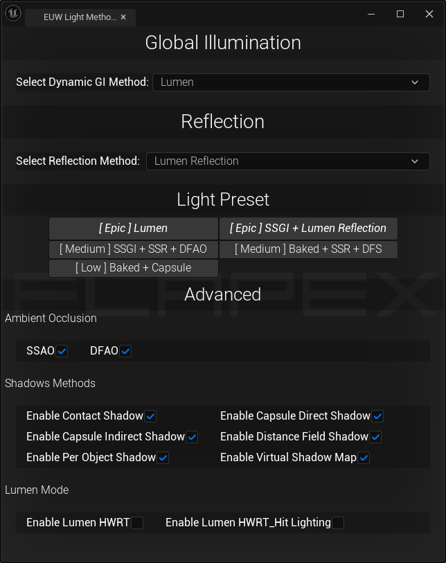

# Unreal_Light_Method_Tool
This is a quick adjustment tool made to make it easier to observe the use of different lighting methods in UnrealEngine, such as quickly switching between Lumen and SSGI.

Screenshot of the tool's interface

